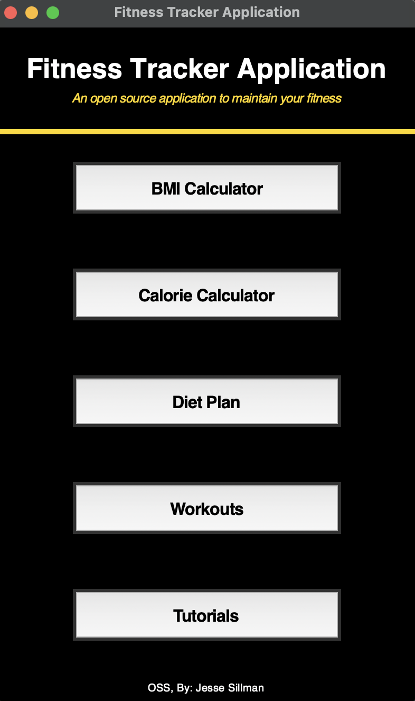
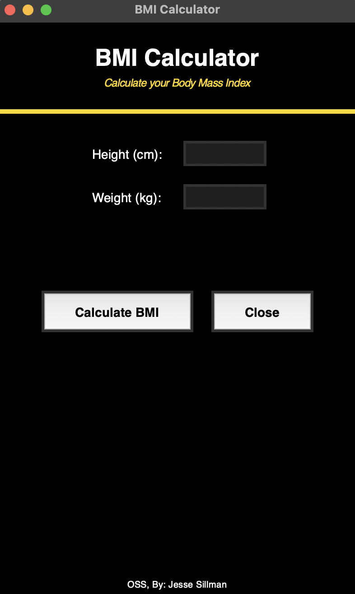
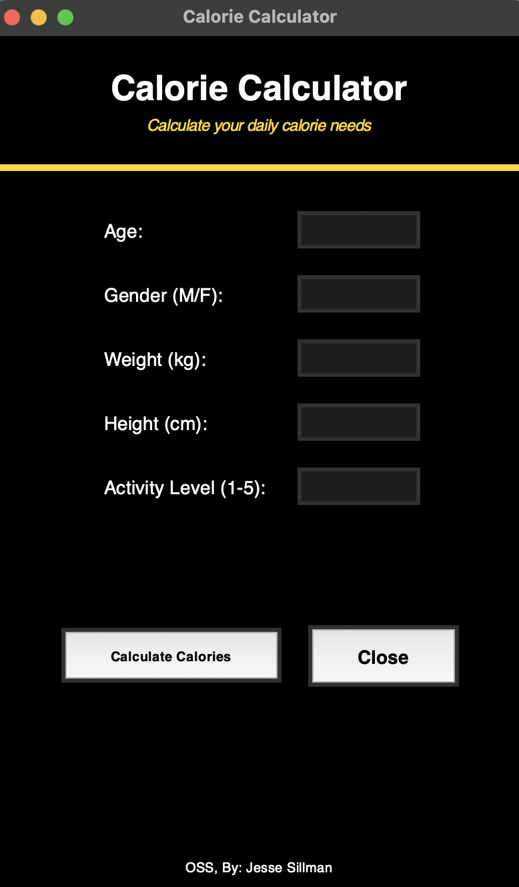
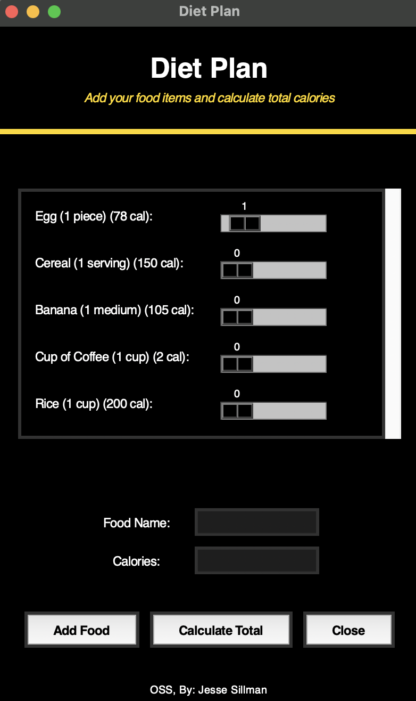
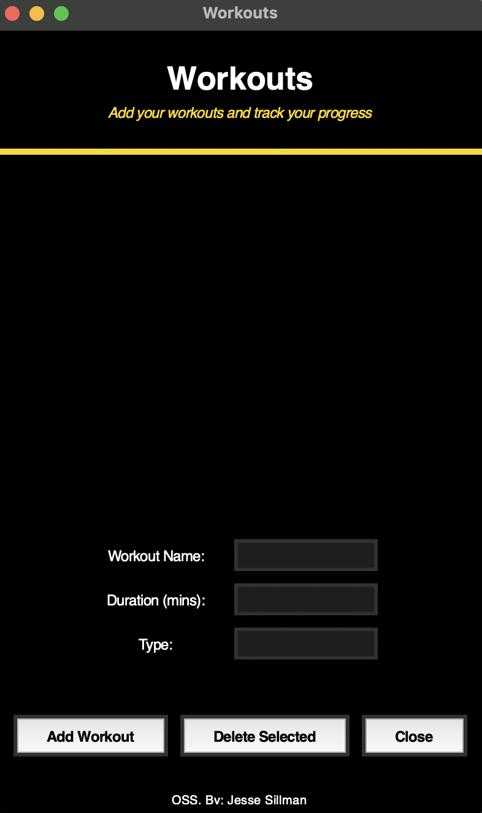
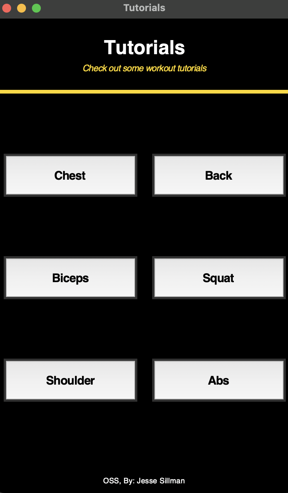

# OSS Final Project - Fitness Tracker Application

To run the `fitnesstracker.py`project, follow these steps:

1. **Install Python 3**  

2. **Download the Project Files**  

3. **Open the Terminal or Command Prompt**  
   - Navigate to the directory where the project file is saved using the following command:
     ```bash
     cd path/to/project/directory
     ```

4. **Run the Script**  
   - Execute the project by running the following command:
     ```bash
     python fitnesstracker.py
     ```

## Introduction

In the Open Source Software course, we were instructed to create an open source application using Python. I decided to create a simple fitness application to get more acquainted with `tkinter`, a Python library that allows the developers to build a graphical user interface (GUI) applications. This project is designed to manage fitness-related tasks, such as calculating BMI, estimating daily calorie needs, planning diets, tracking workouts, and providing workout tutorials. 

## Main Page and Operations

The main page serves as the gateway to various functionalities, where the buttons lead to different operations: BMI Calculator, Calorie Calculator, Diet Plan, Workouts, and Tutorials.

I constructed the main page with a title and a subtitle that describe the application's purpose. The title is displayed in bold for emphasis, while the subtitle is in italic gold font to create a nice contrast. A gold line nelow the subtitle adds a clear divider and improves the layout. A footer with the text `OSS, By: Jesse Sillman` was manually added to every page, appearing at the bottom of each window for consistent branding and acknowledgment.



*Figure 1. Main Page of the OSS Project*

In addition, I created the `def setup_title_section` that standardizes the layout of the title section accross all pages, maintaining a cohensive design throughout the application.

## BMI Calculator

The BMI Calculator allows the user to calculate their Body Mass Index (BMI) by entering their height (cm) and weight (kg). The result includes the BMI value and its interpretation (e.g., Underweight, Normal, Overweight, or Obese).

The implementation of the BMI calculator is done through a dedicated function, `def calculate_bmi(height, weight`, and the BMI value is then evaluated against predefined thresholds to determine the category.



*Figure 2. The page of BMI Calculator*

## Calorie Calculator

The Calorie Calculator estimates the user's daily caloric based on key inputs such as weight (kg), height (cm), age (years), gender, and activity level. It uses the Harris-Benedict Equation, a widely accepted formula for calculating Basai Metabolic Rate (BMR), and adjusts it based on the user's activity level to find their Total Daily Energy Expenditure (TDEE).

The implementation of the calorie calculator is done through the function `def calculate_calories(weight, height, age, gender, activity_level)`.



*Figure 3. The page of Calorie Calculator*

## Diet Plan

The Diet Plan feature allows users to create a customized meal plan by selecting predefined food items or adding their own. It helps users calculate the total calories consumed based on the selected food items and their quantities.

In addition, the user can enter the `food name` and `calories per unit` using the input fields provided on the Diet Plan page. They can also select the quantity of each food item, and the Calculate Total button computes the total calorie intake by multiplying the quantity of each selected item by its calorie value.



*Figure 4. The page of Diets*

## Workouts

The Workouts feature allows the user to log their exercises by entering details such as the `workout name`, `duration` (in minutes), and `type` (e.g., cardio, strength, etc.) using the input fields provided on the Workouts page. Users can add their workout to the list by clicking the Add Workout button, which displays the entered information in the listbox.

In addition, the feature provides the option to manage logged workouts, allowing the user to select and remove workout from the list using the `Delete Selected` button, hepling them to track their workout routines and review their progress conveniently.



*Figure 6. The page of Workouts*

## Tutorials

The Tutorials feature provides the user with a quick access to helpful workout tutorials categorized by different body parts, such as chest, back, biceps, legs, shoulders, and abs. Each tutorial is linked to a Youtube video, which users can open by clicking the button on the Tutorials page. This feature is is designed to guide users in performing exercises correctly and effectively.



*Figure 7. The page of Tutorials*

## Summary

Building this `Fitness Tracker Application` project allowed me to delve deeper into the use of `tkinter` for building graphical user interfaces in Python. By creating these functions I gained a better understanding how we enhance the user experience through thoughtful interface design and functionality.

Working on this project highlighted the flexibility of `tkinter` for creating GUI applications but also revealed its limitations compared to other modern advanced frameworks PyQt, Kivy, or other alternatives provide greater customization, scalability, and design options for building highly interactive and visually appealing interfaces.

Overall, this project was a great learning experience how we can create Python projects with GUI development, as my previous experience was mainly focused on scripting and automation in interpreted languages.


